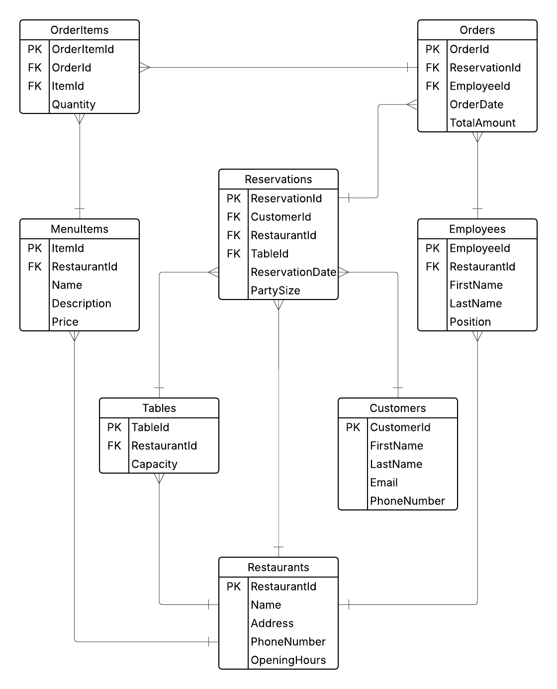

## **Restaurant Reservation Management System: Database Project**

## **Background**:

A group of restaurants wishes to transition from their traditional ordering and reservation system to a more robust digital platform. They are looking for a system that can efficiently manage their restaurant operations, including tracking orders, menu items, reservations, and more.

## **Objective**:

Design and implement a relational database using MS SQL that supports the restaurant’s operations and offers extensive querying capabilities.

## **Requirements**:

### **1. Design an Entity Relationship Model (ERM) Diagram**:

- **Entities**: Illustrate entities: Restaurants, MenuItems, OrderItems, Orders, Employees, Customers, Tables, Reservations.
- **Attributes**: Detail attributes for each entity.
- **Relationships**: Exhibit connections between entities.
- **Connectivity and Cardinality**: Notate the relationship type between entities.
- **Keys**: Mark primary (PK) and foreign keys (FK).
- **Tools**: Opt for ERDPlus, Lucidchart, or similar tools. Include the diagram in the repository.

### **2. Design the Relational Schema using MS SQL**:

- **Restaurants**:
    - RestaurantId (PK)
    - Name
    - Address
    - PhoneNumber
    - OpeningHours
- **MenuItems:**
    - ItemId (PK)
    - RestaurantId
    - Name
    - Description
    - Price
- **OrderItems**:
    - OrderItemId (PK)
    - OrderId
    - ItemId
    - Quantity
- **Orders:**
    - OrderId (PK)
    - ReservationId
    - EmployeeId
    - OrderDate
    - TotalAmount
- **Employees**:
    - EmployeeId (PK)
    - RestaurantId
    - FirstName
    - LastName
    - Position
- **Reservations**:
    - ReservationId (PK)
    - CustomerId
    - RestaurantId
    - TableId
    - ReservationDate
    - PartySize
- **Customers**:
    - CustomerId (PK)
    - FistName
    - LastName
    - Email
    - PhoneNumber
- **Tables**:
    - TableId
    - RestaurantId
    - Capacity

### **3. Build and Seed the Database**:

- Construct the database in PostgreSQL.
- Seed with fictional data: Populate 50 restaurants, 1000 menu items, and 1500 order items, 500 orders, 100 employees, 500 reservations, 400 customers, 100 tables records. **Include DML scripts for seeding** in the GitHub repository. (Try generating the data by yourself and make sure it is consistent and preferably meaningful. You may use some websites, tools, or scripts to generate this data).

### **4. Complex Queries and Procedures**:

⚠️ **Note**: Each of the following requirements should be implemented in a separate SQL file and pushed to the GitHub repository in a distinct commit.

1. List of Reservations: Retrieve all reservations for a specific customers.
2. List of Managers: Retrieve all employees holding `Manager` position. 
3. List of Orders and Menu Items: Lists the orders placed on a specific given reservation along with the associated menu items.
4. List of Ordered Menu Items: Lists the menu items ordered by a specific reservation.
5. Calculate Average Order Amount: Calculate the average order amount made through a specific employee.
6. Retrieve Reservations Report with Views: Use a view to list all reservations information including restaurants and customers information.
7. Retrieve Employees details with Views: Use a view to list all employees information including their restaurants details
8. **Reservation’s Order with CTEs**: Identify reservations which have 2 or more orders using CTEs.
9. **Restaurant Popularity using Aggregation**: Rank restaurants by the reservation frequency.
10. **Popular Menu Item Analysis using Joins and Window Functions**: Identify the most popular menu item for each restaurant for a given month.
11.  **Database Function - Calculate Restaurant Revenue**:
    - **Function Name**: **`fn_CalculateRevenue`**
    - **Purpose**: Compute revenue made by a specific restaurant.
    - **Parameter**: `RestaurantId`
    - **Return**: total revenue amount for the `RestaurantId` .
12. **Database Function - Calculate Employees Salary**:
    - **Function Name**: **`fn_CalculateEmployeeSalary`**
    - **Purpose**: Compute the salary for a given employee.
    - **Parameter**: `EmployeeId`
    - **Implementation**: Salary is defined as: # number of orders made by specific employee * employee rank.
        - Employee’s rank based on position: Position = `VIPOrdersWaiter` = 5, `StandardWaiter` = 4, `AssistantWaiter`  = 3.
    - **Return**: salary for the `EmployeeId`.
13. **Stored Procedure - Borrowed Books Report**:
    - **Procedure Name**: **`sp_ResrvedTablesReport`**
    - **Purpose**: Generate a report of tables reserved within a specified date range.
    - **Parameters**: **`StartDate`**, **`EndDate`**
    - **Implementation**: Retrieve all tables reserved within the given range, with details like reservation date, party size and restaurant details.
    - **Return**: Tabulated report of reserved tables.
14. **Stored Procedure - Add New Order**:
    - **Procedure Name**: **`sp_AddNewOrder`**
    - **Purpose**: Streamline the process of adding a new order.
    - **Parameters**: **`ReservationId`**, **`EmployeeId`**, **`OrderDate`**, and **`TotalAmount`**.
    - **Implementation**: Check if the specified reservation and employee exist, if not, return an error message, if existing, add new order.
    - **Return**: The new **`BorrowerID`** or an error message.
15. **SQL Stored Procedure with Temp Table**:
    - Design a stored procedure that retrieves all tables which have future reservations. Store these tables in a temporary table, then join this temp table with the **`Restaurants`** table to list out the specific information about the associated restaurants.
16. **Trigger Implementation**
    - Design a trigger to log an entry into a separate **`AuditLog`** table whenever a table get reserved. The **`AuditLog`** should capture `ResturantId`, `TableId`, `ReservationDate` and **`ChangeDate`**.
17. Query Plans Part1:
    - Select 5 complex queries from the above queries and check their query plans. 
18. Indexing: Make Tech-Lib Faster (Not Applicable) 
    - Create the needed Indexes to the Tech-Lib project you built earlier.
19. Query Plans Part2:
    - Check the query plans for the 5 queries selected in Req #17 after adding some indexes.

### Note: **Submission to GitHub**:

- Push SQL scripts (schema creation, seeding DMLs, queries, procedures, and trigger) to a GitHub repository. Incorporate a README detailing the project, schema, and rationale behind each query/procedure.

---

## Solution:

### ERD

### Schema:
Table/index creation and deletion migrations are available in the [sql/schema](./sql/schema) directory.

### Seeding:
I used a simple seeding script that can be used as a migration. It can be found [here](./sql/999_seed.sql).

### Queries:
Required queries and scripts can be found at [sql/queries](./sql/queries). They are missing q18 on purpose as that one relates to a project that is not in my learning plan.

### Note:
This project was designed to be solved using a MS SQL database, so some required features are not available in PostgreSQL, and in case a required feature for a certain query is unavailable, it is mentioned in the query file and anything you need to know will be there too.